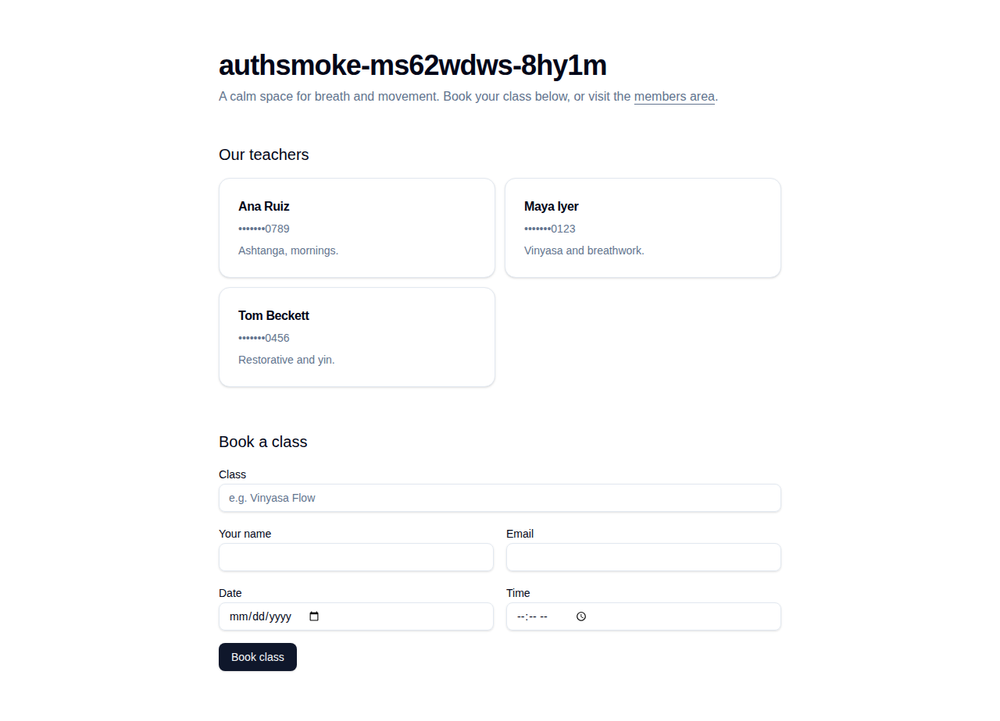
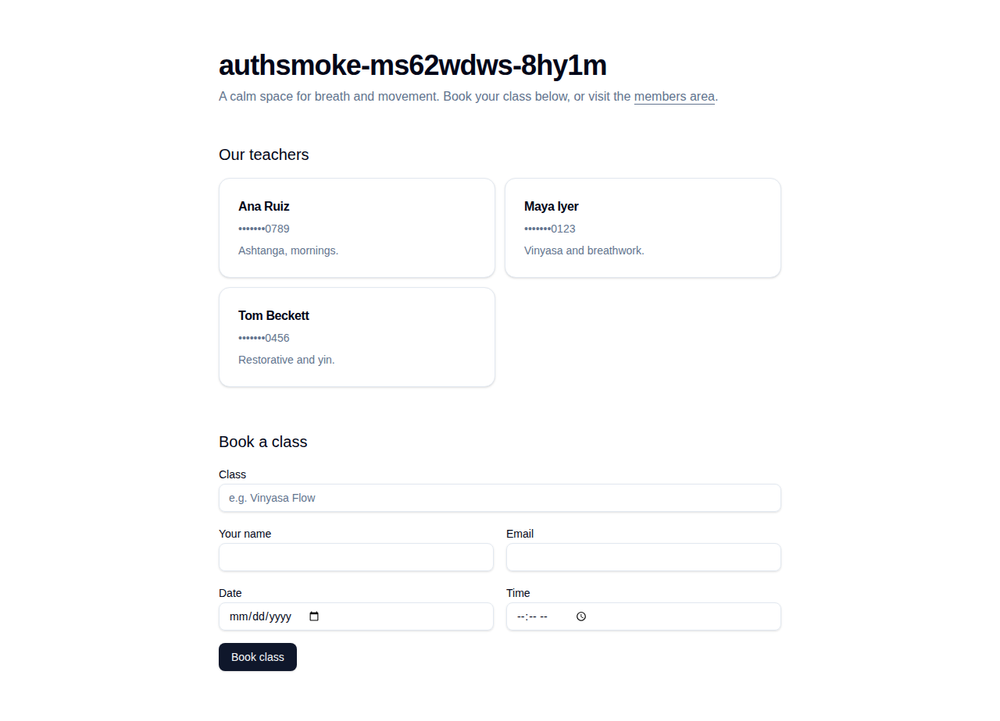

# Auth layer — production audit

Run against `https://isibi.ai` · 86 passed, 1 failed.

## the site

- ✅ build returns 200
- ✅ every declared table was created
- ✅ the display table was seeded
- ✅ a real app was published, not the placeholder

## signup

- ✅ signup creates an account and returns a session
- ✅ a short password is refused
- ✅ an invalid address is refused
- ✅ a duplicate address is 409 `exists`
- ✅ a BREACHED password is refused

## login

- ✅ login returns a session for the right password
- ✅ a wrong password is 401
- ✅ an unknown address answers BYTE-IDENTICALLY to a wrong password

## sessions and token kinds

- ✅ `me` resolves a session to the account
- ✅ `me` with no token is 401
- ✅ `me` with a garbage token is 401
- ✅ `me` with a truncated token is 401
- ✅ a token is useless against a different site
- ✅ `sessions` lists this account's devices
- ✅ exactly one device is marked `current`
- ✅ the token's own device appears in the list
- ✅ a device is named, not dumped as a UA string
- ✅ revoking ONE device succeeds
- ✅ the revoked device's token stops working
- ✅ the device you are reading from still works
- ✅ revoking it twice is a 404, not a silent success
- ✅ an unknown sid answers identically to somebody else's

## account controls

- ✅ changing a password needs the CURRENT one
- ✅ a BREACHED new password is refused
- ✅ a signed-in member can change their password
- ✅ the password change signs OTHER sessions out
- ✅ ...and keeps the one that made the change
- ✅ the old password no longer works
- ✅ the new password does
- ✅ changing an address needs the current password
- ✅ a member can change their address
- ✅ the new address logs in
- ✅ the old address does not

## data scoping

- ✅ a `display` table is readable by anyone
- ✅ a MASKED column is redacted for the public
- ✅ no query string can unmask it
- ✅ a `display` table refuses a public write
- ✅ a `collect` table refuses a public READ
- ✅ a `user` table answers 401 to a signed-OUT visitor
- ✅ a member can write to a `user` table
- ✅ a `user` read returns ONLY the caller's own rows
- ✅ another member's row answers 404, NOT 403
- ✅ a `publicView` projection is readable by anyone
- ✅ the projection carries NO id

## submissions and claim links

- ✅ anyone can submit to a `collect` table
- ✅ the submission comes back with a CLAIM token
- ✅ a `unique` constraint refuses the same slot twice (409)
- ✅ ...but a different slot is accepted
- ✅ a claim token reads back that one row
- ✅ a bad claim is 404
- ✅ a claim does NOT open the neighbouring row
- ✅ a claim token is NOT a session
- ✅ a claim can cancel its own row
- ✅ cancelling twice is idempotent, not an error

## roles, and the owner's door

- ✅ an `admin` table refuses a plain member's write
- ✅ the owner can list the site's members
- ✅ the member list does NOT carry password hashes
- ✅ the owner can grant a role
- ✅ ...and the granted role can now write
- ✅ the owner can suspend a member
- ✅ a suspended member's token stops working at once
- ✅ a suspended member's login is byte-identical to a wrong password
- ✅ ...and can reinstate them

## who may become a member

- ✅ the owner can close signups
- ✅ a CLOSED site refuses a new account
- ✅ the owner can require an invite
- ✅ invite-only refuses a signup with no code
- ✅ a wrong code answers identically to no code
- ✅ the owner can mint an invite code
- ✅ a valid code lets somebody in
- ✅ a one-use code cannot be used twice
- ✅ a domain allow-list refuses an address outside it
- ✅ ...and admits one inside it
- ✅ a SUBDOMAIN does not match
- ✅ a lookalike domain does not match

## the published site, in a real browser

- ✅ the published site serves 200
- ✅ the app actually RENDERED (root is not empty)
- ✅ no uncaught error on load
- ✅ seeded content is on the page
- ✅ the masked phone is NOT rendered in full
- ✅ a member can be signed in from inside the published page
- ✅ the stored session actually opens a member-scoped read
- ❌ the published bundle reads the session key the platform writes — `no bundle references `site_session_` — a stored session would be ignored: {"found":false,"scripts":1,"fetched":1}`

## The published site

